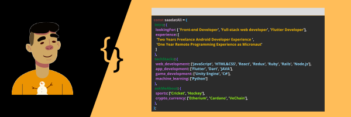

# Hey, I'm Faizaan👋

 

## Who's me :thinking:?
Let me write quickly about myself without bragging:

- 🥇 Computer Scientist by Degree and Software Developer by passion.
- 🔮 Like to create responsive re-usable component based Web Front End with React.js/Next.js
- 🎨 Experienced with Nodejs for Backend
- 📱  Android Developer (React Native)
- 🥽 Enthusiast in Machine Learning and Artificial Intelligence
- ✨ Full-time coder and part-time Otaku
- 🤤 Sports: BasketBall, Badminton

 ## Tech Stack :hammer_and_wrench::
 - 👉 React.js | Redux | Next.js | node.js | SQL | NOSQL | Postgres | Mongo
 - 👉 Android | React Native 
 - 👉 Machine Learning | python | tensorflow | pytorch 

## Connect with me 🤝:
[][gmail]
[][facebook]
[][instagram]
[][linkedin]
[][whatsapp]

---

### :zap: GitHub Stats

### 🚀 GitHub Streak Stats

More Stats

 

---

### :zap: Recent GitHub Activity

<!--RECENT_ACTIVITY:start-->
1. ⬆️ Pushed 1 commit(s) to [Readme-Workflows/recent-activity](https://github.com/Readme-Workflows/recent-activity) 
2. ⬆️ Pushed 1 commit(s) to [Readme-Workflows/recent-activity](https://github.com/Readme-Workflows/recent-activity) 
3. ⬆️ Pushed 1 commit(s) to [Readme-Workflows/recent-activity](https://github.com/Readme-Workflows/recent-activity) 
4. ⬆️ Pushed 1 commit(s) to [Readme-Workflows/recent-activity](https://github.com/Readme-Workflows/recent-activity) 
5. ⬆️ Pushed 1 commit(s) to [Readme-Workflows/recent-activity](https://github.com/Readme-Workflows/recent-activity) 
<!--RECENT_ACTIVITY:end-->
<!--RECENT_ACTIVITY:last_update-->
Last Updated: Sunday, October 6th, 2024, 1:07:16 PM
<!--RECENT_ACTIVITY:last_update_end-->

# Point To Ponder 

[instagram]: https://www.instagram.com/being_faizi/
[linkedin]: https://www.linkedin.com/in/faizaan-fazal-a02246242/
[whatsapp]: https://api.whatsapp.com/send?phone=923467143002
[facebook]: https://www.facebook.com/Faizaan7162/
[gmail]: mailto:dkfaizaan12@gmail.com
