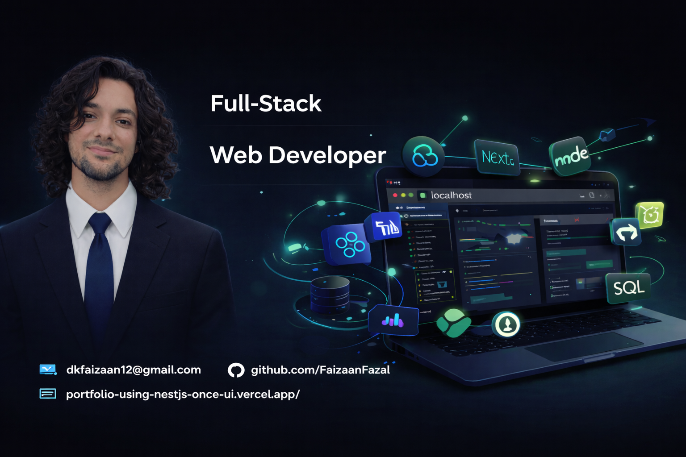

  

<h1 align="center">Faizaan Fazal Khan</h1>

  <strong>AI/ML Researcher &amp; Software Engineer</strong> 
  Biomedical Imaging · Computer Vision · Longitudinal ML · Trustworthy AI

  
  
  
  
  
  

I develop machine-learning systems for biomedical imaging and longitudinal healthcare prediction, with research spanning 3D medical image analysis, multimodal learning, survival modelling, uncertainty quantification, and externally validated predictive modelling. My software-engineering background in Python, TypeScript, React/Next.js, and Node.js enables me to work across the complete pipeline—from rigorous experimental design and reproducible model development to APIs, visualization, and maintainable research software.

**M.S. Information & Communication Engineering — Chosun University, South Korea** 
Research focus: AI-driven biomedical imaging and Alzheimer's disease modelling.

## Research Focus

`Medical Imaging` · `Computer Vision` · `3D Deep Learning` · `Multimodal AI` · `Longitudinal Modelling` · `Survival Analysis` · `Trustworthy AI` · `Explainable AI` · `Uncertainty Quantification` · `Foundation Models`

## Published Research & Code

- **APOE ε4 Dose and MCI-to-AD Conversion** — *Biomedicines*, 2026 · [Paper](https://doi.org/10.3390/biomedicines14061280) · [Code](https://github.com/FaizaanFazal/apoe4-mci-ad-survival-analysis) 
  **Methods:** Longitudinal ADNI, Kaplan–Meier estimation, Cox proportional hazards, and sensitivity analyses.

- **APOE ε4 × Hippocampal Volume in Cognitive Decline** — *Frontiers in Aging Neuroscience*, 2026 · [Paper](https://doi.org/10.3389/fnagi.2026.1730265) · [Code](https://github.com/FaizaanFazal/adni-apoe4-hippocampus-cognitive-decline) 
  **Methods:** Linear mixed-effects models, hippocampal volumetry, survival analysis, and sensitivity analyses.

- **Dataset-Aware 3D Hippocampal Segmentation** — *Mathematics*, 2025 · [Paper](https://doi.org/10.3390/math13203309) · [Code](https://github.com/FaizaanFazal/Ablation-full-code-3DUnet-hippocampus) 
  **Methods:** 3D U-Net MRI segmentation, dataset-aware preprocessing, ablation studies, and cross-dataset transfer across HarP/ADNI and the Medical Segmentation Decathlon.

## Current Research

### Reliable Multimodal Alzheimer's Prognosis

Developing baseline and landmark survival models that integrate multimodal clinical and biomarker information through a leakage-safe temporal design, with conformal uncertainty calibration, informative-missingness analysis, and external validation for transportability.

### Dynamic Cognitive-State Prediction

Modelling cognitive improvement, persistence, and progression through longitudinal updating and participant-grouped methods, using a locked ADNI-to-OASIS-3 external validation protocol to assess calibration and transportability.

### 3D Alzheimer's MRI Staging

Investigating six diagnostic stages from structural MRI using subject-level splitting, a multi-scale 3D CNN, imbalance-aware learning, robust class-wise evaluation, and model explanations.

## Selected Publications

- **APOE ε4 Allele Dose and Time to Clinical Conversion from Mild Cognitive Impairment to Alzheimer's Disease Dementia: An ADNI Survival Analysis.** *Biomedicines*, 2026. [DOI](https://doi.org/10.3390/biomedicines14061280)
- **APOE ε4 as a Predictor of Cognitive Decline and Its Interaction with Hippocampal Volume in Alzheimer's Disease.** *Frontiers in Aging Neuroscience*, 2026. [DOI](https://doi.org/10.3389/fnagi.2026.1730265)
- **A Resource-Efficient 3D U-Net for Hippocampus Segmentation Using CLAHE and SCE-3DWT Techniques.** *IEEE Access*, 2025. [DOI](https://doi.org/10.1109/ACCESS.2025.3577266)
- **Dataset-Aware Preprocessing for Hippocampal Segmentation: Insights from Ablation and Transfer Learning.** *Mathematics*, 2025. [DOI](https://doi.org/10.3390/math13203309)

See the complete publication record on [Google Scholar](https://scholar.google.com/citations?user=EhVLylsAAAAJ&hl=en).

## Research & Engineering Stack

| Area | Tools and methods |
| --- | --- |
| **Machine Learning & Deep Learning** | Python, PyTorch, TensorFlow, Scikit-learn, MONAI, Hugging Face Transformers |
| **Medical Imaging & Computer Vision** | OpenCV, SimpleITK, NiBabel, FSL, SPM, ANTs, 3D Slicer, ITK-SNAP, Open3D |
| **Statistical & Research Computing** | NumPy, Pandas, survival analysis, Cox regression, statistical validation, XAI, uncertainty quantification |
| **Software Engineering** | JavaScript, TypeScript, React, Next.js, Node.js, REST APIs, PostgreSQL, MongoDB |
| **Infrastructure & Research Tooling** | Docker, Linux, Git, GitHub, Jupyter, GPU/HPC workflows, LaTeX, Overleaf |

## Engineering Background

Alongside research, I have built production-oriented web software with React, Next.js, Node.js, and TypeScript and led development work through Git-based collaborative workflows. This background shapes how I structure research code: modular pipelines, reproducible experiments, explicit configuration, testing, and maintainable interfaces that translate analytical prototypes into reliable software.

## Selected Engineering Work

| Repository | What it demonstrates | Technologies |
| --- | --- | --- |
| [Portfolio-Using-Nestjs-OnceUi](https://github.com/FaizaanFazal/Portfolio-Using-Nestjs-OnceUi) | A content-driven professional portfolio with reusable presentation components, theming, and MDX content. | Next.js, TypeScript, React, MDX, Once UI |
| [Editorjs-tools-in-nextjs](https://github.com/FaizaanFazal/Editorjs-tools-in-nextjs) | An Editor.js authoring and rendering toolkit with custom block renderers and server-side metadata retrieval. | Next.js, TypeScript, Editor.js, React |
| [Blog-Website-Using-Test-Driven-Development](https://github.com/FaizaanFazal/Blog-Website-Using-Test-Driven-Development) | A React/Redux blog interface developed with extensive component, interaction, and snapshot tests. | React, Redux Toolkit, Jest, Testing Library, SCSS |

## Contact

I welcome conversations about biomedical AI, medical imaging, trustworthy machine learning, research engineering, and software systems. The best ways to reach me are through [email](mailto:dkfaizaan12@gmail.com) or [LinkedIn](https://www.linkedin.com/in/faizaan-fazal-a02246242/).
